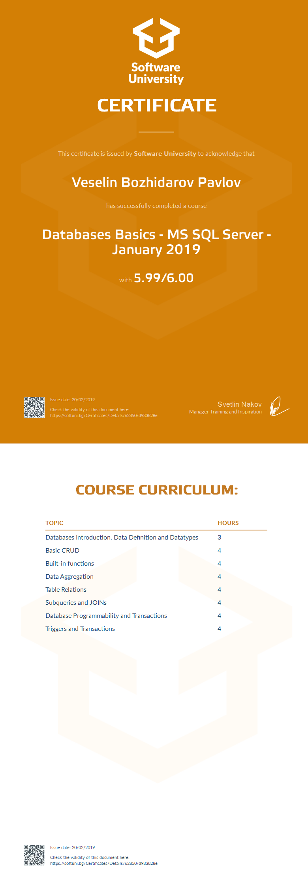

# Course: Database Basics – MS SQL

## Topics:
01. Data Definition and Datatypes
02. Basic CRUD
03. Build-In Functions
04. Data Aggregation
05. Table Relations
06. Subqueries and Joins
07. Database Programmability and Transactions
08. Functions and Procedures

## Certificate: 

## Notes:
All labs and resources for them are remodeled from MySQL course.
 
